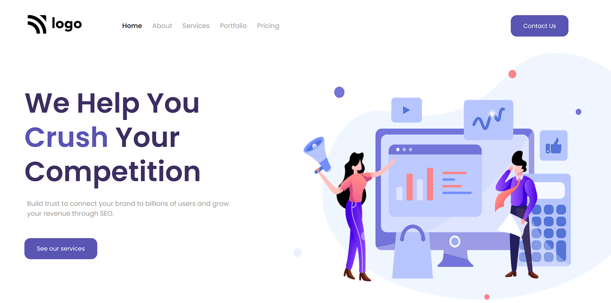

# SEO Help Web Page

> ## [Mansi Gupta](https://twitter.com/butwhymansi)

 

## Tech Stack:

### _Live Hosted Link 🚀_ : _[SEO Help](https://lucky-crumble-9a3e60.netlify.app/)_

## How the website looks like:

## My Learnings

-   Skills Gained in this project
    -   Learned to use svg as background image.
    -   Learned to select any specific element using :nth-child(), :first-child & :last-child. 

---